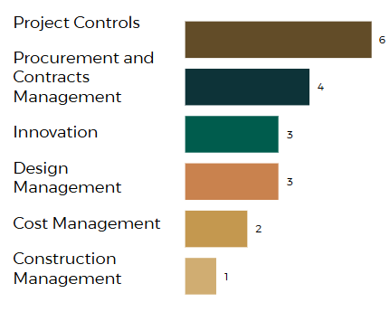
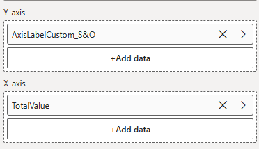
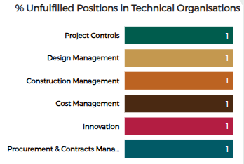

##### The Clustered Bar Chart allows us to display performance of certain indicators against a group

### Creating Clustered Bar Charts sorted by Custom Order

In the clustered bar chart, if we need a custom order in which data points are seen, we can do that by creating a new Column in our table in power query. Using the custom Column option from Add Column



In **Custom Column** add the condition that will add columns in the sorted order 

For example: 
    
    ```
    if [Additional Data Point] = "% Unfilled positions in Project Controls" then 1

    else if [Additional Data Point] = "% Unfilled positions in Design Management " then 2

    else if [Additional Data Point] = "% Unfilled positions in Construction Management" then 3

    else if [Additional Data Point] = "% Unfilled positions in Cost Management" then 4

    else if [Additional Data Point] = "% Unfilled positions in Innovation" then 5

    else if [Additional Data Point] = "% Unfilled positions in Procurement and Contracts Management" then 6
    else 999

    ```

:::info

These conditions are defining the order of the datapoints

:::

### Renaming Columns

Next step is to rename the Column, orginal columns look like this which is not in the required form to show on the graph


To add different names to the graph, create a new Column in the *AddDataPoint(S&O)* table. 

The column is named as here *AxisLabelCustom_S&O*

```
AxisLabelCustom_S&O = 
SWITCH(
    TRUE(),
    'AddDataPoint(S&O)'[Additional Data Point] = "% Unfilled positions in Project Controls", "Project Controls",
    'AddDataPoint(S&O)'[Additional Data Point] = "% Unfilled positions in Design Management", "Design Management",
    'AddDataPoint(S&O)'[Additional Data Point] = "% Unfilled positions in Construction Management", "Construction Management",
    'AddDataPoint(S&O)'[Additional Data Point] = "% Unfilled positions in Cost Management", "Cost Management",
    'AddDataPoint(S&O)'[Additional Data Point] = "% Unfilled positions in Innovation", "Innovation",
    'AddDataPoint(S&O)'[Additional Data Point] = "% Unfilled positions in Procurement and Contracts Management", "Procurement & Contracts Management"

)
```

SWITCH and TRUE are used here to check multiple conditions in order and resturn a result for the one if thats true, in the case the returned result is the redefined column name

:::note

We add a new Column with redefined names as we want original Columns to remain unchanged and has to remain same as the data source

:::

### Sorting Columns

After redefining Column names, we sort this Column on the basis of our Custom Column to sort the datapoints

1. Select the column *AxisLabelCustom_S&O*
2. Once the column has been selected, on the *Column Tools* pane, click on *Sort by Column*

3. In the *Sort by Column* option, click on the order in which we want our Column started, in this case **Custom** as the order of our data is based on the order defined in our *Custom Column*.  

1. Columns cannot be dragged in as measures directly to create bar charts so aggregation has to be used as measures must return a single single number and visuals like bar chart need aggregated numeric values to display height or length of each bar segment. To create a measure that aggregates this Column we name it TotalValue and use SUM aggregator
`
TotalValue = SUM('AddDataPoint(S&O)'[Value])
`
1. Then since its a Clustered bar chart, add the required Column names in Y-Axis and the TotalValue Column in X-axis



This is the chart in the required order of data points and renamed Columns. The values of 1 are just taken as a sample to create this chart.  

