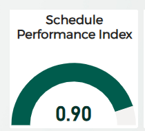

##### The Gauge allows us to display percentages in a captivating manner

Right click on the visual and click Format. The format window should open up. Under **Bars**, adjust the individual colors of the bars as shown below:

    

    
    
  

