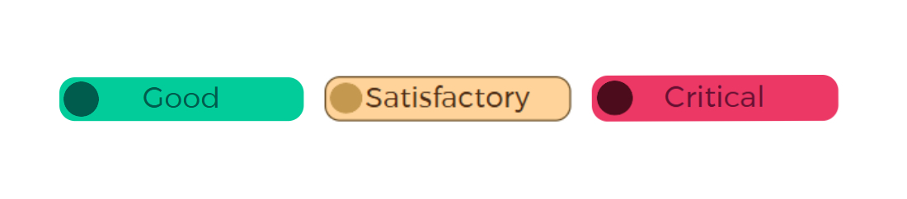

# Traffic Light Indicators

There are 3 indicator colors for Good, Satisfactory, and Critical.


To control the colour of the displayed text, a new measure is created with the following DAX:
```
selected rating = SELECTEDVALUE('DevCoAssessmentAnalysis(CE&O)'[Rating])
```
and subsequently applied to the fields section on the **basic card** visual

The colours for the indicators are applied across the entire dashboard from the **BackgroundColor** measure with the following DAX

```
RatingColors = 
DATATABLE("Rating", STRING,"FontColor", STRING, "BackgroundColor", STRING, "AccentBarColor", STRING, {{"Critical", "#670F31", "#EB3865", "#4D0C1C"}, {"Satisfactory", "#4A2912", "#FFD399", "#4A2912"}, {"Good", "#005C4D", "#02CD9A", "#005C4D"}})
```
:::tip[Sizing]

The size of the indicators should be 110px x 40px

:::