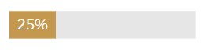
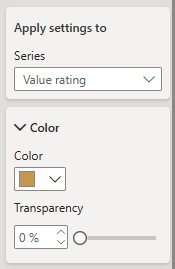
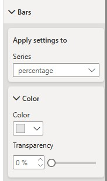

# Stacked Bar Chart

The stacked bar chart allows us to display percentages in a captivatiing manner

Right click on the visual and click Format. The format window should open up. Under Bars, adjust the individual colors of the bars as shown below:

export const Highlight = ({children, color}) => (
  

    

    {children}
    

  

);

<Highlight color="#1877F2">

</Highlight>
